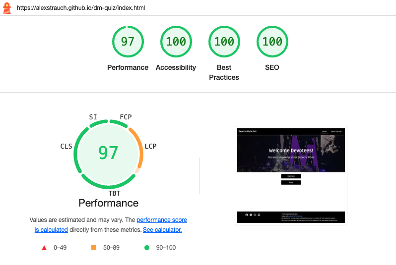

# Depeche Mode Quiz

## A quiz about the band's history and their music!

(Developer: Alexander Strauch)

## **[Live site](https://alexstrauch.github.io/dm-quiz/index.html)**

## Table of contents

1. [Introduction](#introduction)
   - [Project description](#project-description)
   - [Purpose](#purpose)
2. [UX](#ux)
   - [User demographic](#user-demo)
   - [User goals](#user-goals)
   - [User expectations](#user-expectations)
   - [User stories](#user-stories)
3. [Design](#design)
   - [Design choices](#design-choices)
   - [Fonts](#fonts)
   - [Colors](#colors)
   - [Layout](#layout)
   - [Wireframes](#wireframes)
4. [Features](#features)
5. [Future features](#future-features)
6. [Languages](#languages)
7. [Technologies](#technologies)
8. [Testing](#testing)
   - [Link validation](#link-validation)
   - [Form validation](#form-validation)
   - [Responsiveness validation](#responsiveness-validation)
   - [HTML validation](#html-validation)
   - [CSS validation](#css-validation)
   - [JavaScript validation](#js-validation)
   - [Performance](#performance)
   - [Accessibility](#accessibility)
9. [Bugs](#bugs)
10. [Deployment](#deployment)
11. [Credits](#credits)
12. [Acknowledgements](#acknowledgements)

## Introduction

### Project description

- The Depeche Mode quiz is a web application that offers 10 questions each with 4 possible answers about the history of the band and the music they published over the decades.

### Purpose

- The purpose of the project is to make a fun accessible quiz which is visually engaging, providing users with curated content about the band's past and present. The platform was built to inform new fans and hardcore fans through guided questions about their favorite band.

[Back to table of contents](#table-of-contents)

## UX

### User demographic

- This project is intended for Depeche Mode fans and newcomers of all ages who want to dive deeper into the history of the band.

### User goals

- Test knowledge about Depeche Mode's history

- Learn new information together with lesser-known facts and trivia

- Recall memories associated with their favorite songs

- Enjoy a fun activity that combines love for music with interactive entertainment

### User expectations

- Clean modern visual appearance which follows best practices

- Accessible website on all devices

- Responsive design on all devices without layout or performance issues

- User-friendly interface with easy access to the provided information

- Links and features that work the way they are intended to

- Comprehensive insights about certain milestones during the band's history

### User stories

#### User

- As a new fan I want a quiz that helps me discover key songs and albums from Depeche Mode, so that I can become more familiar with their music and join discussions with other fans

- As a casual fan I want to learn more about the history and evolution of Depeche Mode through a fun quiz, so that I can appreciate their music on a deeper level

- As a longtime fan I want to test my knowledge of Depeche Mode's discography, so that I can see how well I know my favorite band

- As a nostalgic listener I want to recall memorable moments associated with Depeche Mode’s music through quiz questions, so that I can relive those experiences

#### Site owner

- As the operator of the site I want to create an engaging Depeche Mode quiz, so that fans can test their knowledge and share their love for the band

- As the the site owner I want to provide an engaging user experience

- As the site owner I want to display important events that took place during the band's history

- As the site owner I want to promote the site to grow the user base

- As the site operator I want to continuously improve the platform

[Back to table of contents](#table-of-contents)

## Design

### Design choices

Being a huge fan of their music, I decided to create a quiz highlighting key facts about the band across different decades. The logo prominently features the website’s name, and the interface is minimalist and clean, prioritizing the content. Each menu link is clearly labeled, helping users easily navigate to the relevant sections. I incorporated ample white space to guide attention to the most important elements.

### Fonts

Fonts were used through import from https://fonts.google.com/. The chosen font for the body was _Ruda_ for its clarity and ease of reading. _Arial, sans-serif_ was chosen as the fallback font for all elements.
To highlight my name with a link to my GitHub profile I used _Rock Salt_.

### Colors

I chose the color scheme of white for the font and black for the background in the menu and the footer because it best represents the band's style with a monochromatic feel to it. These are also applied to the possible answers in the quiz & the action buttons (start, rules) in their natural state.

For the font-color used for the quiz question, the heading and the paragraphs on the about page I chose a classic dark charcoal with a classic white background.

### Layout

I aimed to create an intuitive design with simple navigation. To achieve this, the website logo is positioned in the top left corner, while the navigation links are placed on the top right.The header, containing both the logo and menu, is fixed at the top of the page, ensuring easy access to the navigation as users scroll. At the bottom, the footer includes links to social media accounts (each opening in a new tab) on the left, along with the website name, my name (linked to my GitHub profile), and a note clarifying trademarks, logos, and brand ownership. The site consists of two pages:

- Home with a background image of Depeche Mode during a concert in Toronto underneath the header. The header includes a h1 element with the "Welcome Devotees!" message, underneath that is a paragraph including "Test your knowledge about Depeche Mode".
In the main section below the header are the "Start quiz" button and the "Rules" button.

- About the quiz with a background image of Depeche Mode during a concert in Toronto underneath the header. The header includes a h1 element with the "Welcome Devotees!" message, underneath that is a paragraph including "Test your knowledge about Depeche Mode". In the main section below the header is a h2 element with "About this quiz" and 2 paragraphs with the content of "This Depeche Mode quiz was created as part of my coding bootcamp." and "It's a fun way to test your knowledge of the band's history, albums, songs and more.". Underneath that are 4 images showing the band during concerts from 2006 until 2023.

### Wireframes

Homepage desktop wireframe (Click me)

Homepage tablet wireframe (Click me)

Homepage mobile wireframe (Click me)

[Back to table of contents](#table-of-contents)

## Features

The website contains 2 pages in total.

    
Logo and navigation (Click me)
  
    It is included on all 2 pages.  
    The logo displays the name of the website & is a clickable link to the homepage which is just best practices.  
    On the right there are two links to each of the pages: "Home" and "About the quiz" so the user can easily navigate through.  
    The current page the user is browsing at the moment is highlighted. 
    The logo and the menu are responsive, the page links become a burger menu when viewed on a mobile device.
    

   
    
Hero image (Click me)
     
    Placed on the top of all pages 
    Shows Depeche Mode during a concert in Toronto. 
    Included in it is a h1 element with the "Welcome Devotees!" message. Underneath it is a p element with the content of "Test your knowledge about Depeche Mode". It is responsive, the background image is resized for smaller screens. 
    

    
Footer (Click me)
 
    Appears on all pages. 
    Divided by 2 divs with their class: social-links and footer-info 
    On the left are the social media links which open in a separate tab. 
    On the right is the website name together with my name (clickable, leads to my GitHub profile in a new tab) and the information about ownership rights for trademark, pictures, logo and brand names. 
    It is responsive for all screen sizes, the social media links align over the website name and the accompanying information; both are horizontally centered.
     
    

    
Start quiz & rules button (Click me)

    Placed underneath the hero image. 
    The "Rules" button opens up a modal which briefly informs the user about the rules of the quiz. It can be closed by clicking the x.
    The "Start Quiz" button initiates the pop up of a username input modal. The user can then enter his username and submit it to get the quiz started. 
    He is then greeted with the first question and 4 possible answers. 
    When he selects the correct answer he gets visual feedback underneath the possible answers and the score is incremented. 
    If he chooses the wrong answer he gets a visual feedback underneath the possible answers and is informed of the correct answer. The score is not incremented. 
    The user can't make another selection after he chooses his answer, he gets his feedback if he was right or wrong and the next question is loaded after 2.5 sec. 
    At the end of the quiz the user is informed that he finished the quiz and receives his final score. He can than select to retry the quiz by clicking on the "Retry Quiz" button. 
    It is responsive, the paragraphs shrink in width and adjust in height when viewed on a mobile device or tablet. 
     
     
     
     
     
     
    

    
About this quiz (Click me)

    Placed underneath the hero image. 
    A h2 element followed by 2 short paragraphs briefly what the quiz is about and why it was created. 
    It is responsive, the paragraphs shrink in width and adjust in height when viewed on a mobile device or tablet. 
    

    
Image gallery (Click me)

    Placed on the "About the quiz" page underneath the 2 paragraphs. 
    4 images which show Depeche Mode during different concerts ranging from 2006 until 2023. 
    The images are responsive, they grow / shrink proportionally when screen size grows or shrinks. On a mobile device the images align on top of each other. 
    

[Back to table of contents](#table-of-contents)

## Future features

- more questions

- a timer to put the user under a little bit more pressure

[Back to table of contents](#table-of-contents)

## Languages

- HTML

- CSS

- JavaScript

[Back to table of contents](#table-of-contents)

## Technologies

- GitHub for the repository

- Gitpod (IDE)

- git for version control

- Chrome Dev Tools

- Balsamiq for the wireframes

- For the vinyl record favicon: https://gauger.io/fonticon/

- For the favicon conversion: https://favicon.io

- Font Awesome for the burger menu and the social media logos

- Google Fonts for the _Ruda_ and _Rock Salt_ fonts

- Convertio to compress the images

- Adobe color

- WebAIM for accessibility requirements

- W3C for HTML code validation

- W3C for CSS code validation

[Back to table of contents](#table-of-contents)

## Testing

### Link validation

| Test                                                                                                                              | Result             |
| --------------------------------------------------------------------------------------------------------------------------------- | ------------------ |
| Every link in the navigation menu leads to the correct page                                                                       | :white_check_mark: |
| The social media links each open in a new tab on their corresponding site                                                         | :white_check_mark: |
| When a user clicks on my name in the footer, a new tab is opened and he is forwarded to my GitHub profile                         | :white_check_mark: |
| When a user attempts to directly type a link in the search bar to browse the site and has a typo he is redirected to the 404 page | :white_check_mark: |

### Responsiveness validation

| Test                                                                                                                                              | Result             |
| ------------------------------------------------------------------------------------------------------------------------------------------------- | ------------------ |
| The image gallery displays correctly on mobile devices (images align on top of each other)                                                        | :white_check_mark: |
| Homepage, the username modal, the rules modal, the quiz, the about quiz page, the image gallery display correctly on screens smaller than 768px   | :white_check_mark: |
| Homepage, the username modal, the rules modal, the quiz, the about quiz page, the image gallery display correctly on screens larger than 767px    | :white_check_mark: |
| Homepage, the username modal, the rules modal, the quiz, the about quiz page, the image gallery display correctly                                 | :white_check_mark: |

### HTML validation

index.html (Click me)

I googled if I could use the aria-label on the section element (contains the background-image) and it said it would be useful if the content needed to be conveyed for accessibility reasons.

about.html (Click me)

I googled if I could use the aria-label on the section element (contains the background-image) and it said it would be useful if the content needed to be conveyed for accessibility reasons.

404.html (Click me)

I googled if I could use the aria-label on the section element (contains the background-image) and it said it would be useful if the content needed to be conveyed for accessibility reasons.

### CSS validation

style.css (Click me)

There are no errors. The 2 warnings are about the imported Google Fonts.

### JavaScript validation

script.js (Click me)

There are no errors when passing through the JShint validator.

### Performance

Performance was tested using Lighthouse in Chrome Dev Tools.

index.html (Click me)

about.html (Click me)

404.html (Click me)

### Accessibility

Accessibility was tested using WAVE - Web Accessibility Evaluation Tool. 
The pages have no errors.

index.html (Click me)

about.html (Click me)

404.html (Click me)

[Back to table of contents](#table-of-contents)